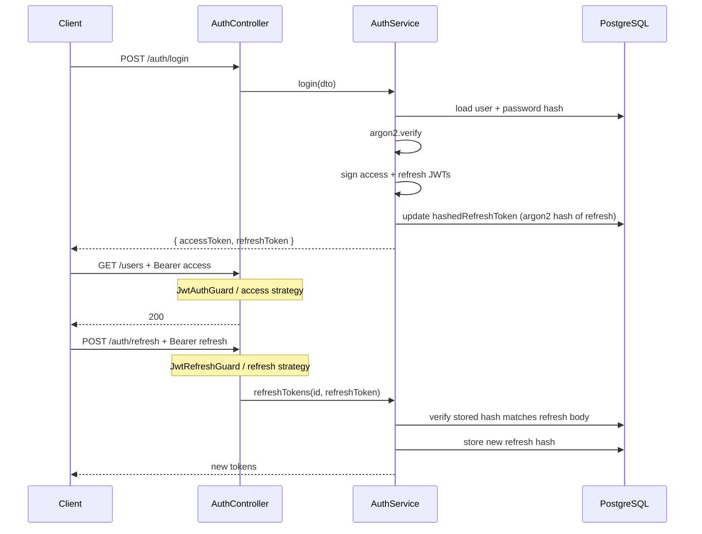

# MusicGPT Backend

NestJS API for user accounts, JWT authentication, **simulated** music prompt generation (BullMQ + cron), subscription tiers, Redis-backed caching and rate limiting, unified search, and Socket.IO completion events.

---

## Table of contents

1. [Architecture summary](#architecture-summary)  
2. [How to run with Docker](#how-to-run-with-docker)  
3. [How to run locally](#how-to-run-locally)  
4. [Environment variables](#environment-variables)  
5. [Authentication flow](#authentication-flow)  
6. [Token rotation and invalidation](#token-rotation--invalidation-strategy)  
7. [Job queue processing flow](#job-queue-processing-flow)  
8. [Cron scheduler](#cron-scheduler-explanation)  
9. [Cache strategy and invalidation](#cache-strategy--invalidation-rules)  
10. [Rate limit logic](#rate-limit-logic)  
11. [Unified search ranking](#unified-search-ranking-logic)  
12. [Subscription perks](#subscription-perks-logic)  
13. [API documentation (Swagger)](#api-documentation-swagger)  

---

## Architecture summary

The service is a **modular NestJS** application built around domain features. External systems are **PostgreSQL** (via Prisma), **Redis** (shared: BullMQ queues, read-through HTTP caches, and rate-limit counters), and **Socket.IO** for realtime “generation completed” notifications.

### General folder structure

The codebase mixes the **NestJS `src/` application** with a **top-level `infrastructure/`** tree used by Prisma and shared database access (so generated client paths stay stable and `PrismaService` can live next to them).

```text
musicgpt/
├── prisma.config.ts              # Prisma CLI config (schema + migrations paths, datasource URL)
├── infrastructure/
│   ├── prisma/                   # schema.prisma + SQL migrations
│   ├── generated/prisma/         # Prisma client output (generated)
│   └── prisma.service.ts         # Global Nest PrismaService (@prisma/adapter-pg)
├── scripts/                      # e.g. seed-sample-data.js
├── docker/                       # API entrypoint (migrate, seed, start)
├── docker-compose.yml
├── Dockerfile
└── src/
    ├── main.ts                   # Bootstrap, Swagger, global pipes
    ├── app.module.ts             # Composes feature + shared modules
    ├── config/                   # Typed env wiring (Nest ConfigModule)
    ├── common/                   # Cross-cutting: rate limit, queue constants, Swagger DTOs
    ├── infrastructure/         # Global Nest modules: PrismaModule, QueueModule (Redis + BullMQ)
    ├── auth/                   # Feature module (see layers below)
    ├── user/
    ├── prompt/
    ├── audio/
    ├── subscription/
    └── search/
```

Each **feature** under `src/<feature>/` is a **vertical slice**: one Nest `*.module.ts` file registers controllers and providers for that slice only.

### Clean architecture in this project

We follow  clean architecture ideas, adapted to Nest’s module system:

| Layer | Responsibility | Dependency rule |
|--------|----------------|-----------------|
| **Domain** | Entities, value types, and **repository interfaces** (ports). No HTTP, Prisma, or Redis APIs here. | Depends on **nothing** inside the app. |
| **Application** | **Use cases** implemented as Nest injectables (`*Service`). Orchestrate domain rules and call **ports** (repository interfaces). | Depends on **domain** abstractions only—not on concrete Prisma classes. |
| **Interface** | **Driving adapters**: REST controllers, request/response DTOs, validation. Translate HTTP → application calls. | Depends on **application** services (and Nest decorators). |
| **Infrastructure** | **Driven adapters**: Prisma repository implementations, BullMQ producers/workers, cron jobs, Socket.IO gateways, Passport strategies. | Implements **domain ports** and is wired in the Nest module **next to** the same feature. |


**Why `auth` looks different:** Controllers and DTOs still form the **interface** layer, but they live under `auth/infrastructure/interface/` so all Passport/JWT **infrastructure** and HTTP **delivery** code stays grouped for that bounded context. The **dependency direction** is unchanged: controllers call `AuthService` (application), and `AuthService` stays free of Express/Passport types except where the framework injects them.

---

### Shared and global pieces (outside a single feature folder)

| Location | Role |
|----------|------|
| **`src/common/`** | Cross-cutting policies: `rate-limit` (guard + Redis Lua), `queue` constants shared by queue module and prompt infra, optional Swagger response DTOs. |
| **`src/infrastructure/`** | **Global** modules: `PrismaModule`, `QueueModule` (IORedis + BullMQ `Queue` instance) exported app-wide. |
| **Root `infrastructure/`** | Prisma schema, migrations, generated client, and `prisma.service.ts` used by `PrismaModule`. |

**Feature map (concise)**

| Area | Role |
|------|------|
| **`src/auth`** | Register/login/refresh/logout; Passport JWT strategies; Argon2 password + refresh hashing. |
| **`src/user`** | Public user listing and profile updates; Redis cache; subscription rate limit on guarded routes. |
| **`src/prompt`** | Creates `PENDING` prompts; cron enqueues BullMQ jobs; worker simulates latency, writes **audio**, marks **COMPLETED**; gateway emits `prompt.completed`. |
| **`src/audio`** | Paginated listing and owner-only title updates; Redis cache (no subscription rate limit guard on these routes). |
| **`src/subscription`** | Toggle `FREE` / `PAID` (queue priority + shared rate limits). |
| **`src/search`** | `GET /search` — two parallel ranked lists (users + audio). |
| **`src/common/rate-limit`** | Shared per-user per-minute budget; HTTP guard + Socket.IO handshake. |

---

## How to run with Docker

From the repository root, with Docker and Docker Compose installed:

Compose V2:

```bash
docker compose up 
```

This sets up the containers and also runs the migration along
with the seed data ready for testing.

**Services**

| Service | Purpose |
|---------|---------|
| **api** | Nest app; on first start runs `prisma migrate deploy` and `node scripts/seed-sample-data.js`, then starts the server. |
| **postgres** | PostgreSQL 16. |
| **redis** | Redis 7 (AOF persistence enabled in compose). |

**Published ports (host)**

| Host port | Maps to | Notes |
|-----------|---------|--------|
| **5001** | API `PORT` | HTTP + Swagger UI. |
| **6009** | Postgres **5432** | Use for GUI clients from the host only. |
| **7889** | Redis **6379** | Host access; **inside** the stack the API uses `redis:6379`. |

Credentials and env for the API are defined inline in `docker-compose.yml` (including `DATABASE_URL`, Redis, JWT). Adjust there for local experiments; use secrets management in real deployments.

**Health and startup order**

The API `depends_on` Postgres and Redis with **`service_healthy`** so migrations and seeds run only after databases are ready.

---

## How to run locally

**Prerequisites**

- Node.js **22** (see `Dockerfile`; LTS-aligned versions work if compatible).
- PostgreSQL and **Redis** reachable from your machine.
- `DATABASE_URL` and Redis settings in `.env` (copy from `.env.example`).

**1. Install dependencies**

```bash
npm install
```

**2. Configure environment**

```bash
cp .env.example .env
# Edit .env: DATABASE_URL, JWT_* secrets, REDIS_*, PORT
```

Use **distinct** long random values for `JWT_ACCESS_SECRET` and `JWT_REFRESH_SECRET`. Ensure `REDIS_PORT` uses `=` (not a colon) in `.env`.

**3. Database**

```bash
npx prisma migrate deploy
# or during development:
# npx prisma migrate dev

npx prisma generate
```

**4. (Optional) Sample data**

```bash
export DATABASE_URL="postgresql://..."   # same as .env
node scripts/seed-sample-data.js
```

**5. Run the API**

```bash
# development (watch)
npm run start:dev

# production build + run
npm run build
npm run start:prod
```

Default **`PORT`** in `.env.example` is **3000**; override with `PORT` in `.env`.

---

## Environment variables

| Variable | Required | Description |
|----------|----------|-------------|
| **`DATABASE_URL`** | Yes | PostgreSQL connection string for Prisma and the seed script. |
| **`JWT_ACCESS_SECRET`** | Yes | Secret for signing **access** JWTs (Passport `jwt` strategy). |
| **`JWT_REFRESH_SECRET`** | Yes | Secret for signing **refresh** JWTs (Passport `jwt-refresh` strategy). Must differ from access secret. |
| **`JWT_ACCESS_EXPIRATION`** | No | Access TTL (e.g. `15m`). Default in code if unset. |
| **`JWT_REFRESH_EXPIRATION`** | No | Refresh TTL (e.g. `7d`). Default in code if unset. |
| **`REDIS_HOST`** | No | Default `127.0.0.1`. |
| **`REDIS_PORT`** | No | Default `6379`. |
| **`REDIS_PASSWORD`** | No | Empty = no auth. |
| **`REDIS_DB`** | No | Default `0`. |
| **`PORT`** | No | HTTP listen port; default `3000` in app bootstrap. |

Prisma reads `DATABASE_URL` from the environment via `prisma.config.ts`.

---

## Authentication flow

Users authenticate with **email + password** (passwords stored with **Argon2**). The API issues two JWTs:

- **Access token** — short-lived; sent as `Authorization: Bearer <access>` on REST routes protected by `JwtAuthGuard`.
- **Refresh token** — longer-lived; sent as `Authorization: Bearer <refresh>` **only** to `POST /auth/refresh` (verified by `JwtRefreshGuard` / `jwt-refresh` strategy).

Both tokens are produced by `@nestjs/jwt` with different secrets (`JWT_ACCESS_SECRET` vs `JWT_REFRESH_SECRET`). Access strategy uses `ExtractJwt.fromAuthHeaderAsBearerToken()` for REST.

**Text flow (register / login)**

```text
Client                          API
  |                              |
  |-- POST /auth/register ------>|  Create user (FREE), hash password
  |<----- access + refresh ------|  Store Argon2 hash of refresh token
  |                              |
  |-- POST /auth/login --------->|  Verify password, issue tokens, rotate refresh hash
  |<----- access + refresh ------|
```

**Text flow (calling a protected route)**

```text
Client                          API
  |                              |
  |-- GET /users Authorization: Bearer <access> --> JwtAuthGuard validates JWT_ACCESS_SECRET
  |<----- 200 + JSON -------------|  req.user = { id, email } payload
```

**Text flow (refresh)**

```text
Client                          API
  |                              |
  |-- POST /auth/refresh Authorization: Bearer <refresh> --> RefreshTokenStrategy (JWT_REFRESH_SECRET)
  |                              |  validate() attaches raw refresh string for service
  |                              |  AuthService: verify Argon2(stored_hash, refresh_body)
  |<----- new access + refresh --|  Replace stored hash with hash(new refresh)
```

**Diagram (high level)**



---

## Token rotation / invalidation strategy

| Mechanism | Behavior |
|-----------|----------|
| **Refresh rotation** | On every successful **register**, **login**, or **refresh**, the server issues a **new** refresh token and replaces `users.hashedRefreshToken` with **Argon2(new refresh)**. Any older refresh JWT still valid in time but not matching the stored hash fails on the next refresh. |
| **Logout** | `POST /auth/logout` (access JWT required) sets `hashedRefreshToken` to **`null`**. Subsequent refresh attempts hit “no stored hash” / mismatch and are rejected (`403` / `Forbidden` path in service). |
| **Access tokens** | Stateless JWTs: **no server-side revocation list**. Compromise is bounded by **`JWT_ACCESS_EXPIRATION`**. To force re-auth sooner, rely on refresh invalidation + short access TTL. |
| **Password change** | Not implemented as a separate flow in this codebase; login/refresh rotation still applies as implemented. |

---

## Job queue processing flow

Prompt “generation” is **simulated**: no external ML API. Work is queued in **BullMQ** backed by the same Redis instance used for caches and rate limits.

**Queue constants** (`src/common/queue/queue.constants.ts`)

- Queue name: **`MUSIC_GENERATION`**
- Job payload: `{ promptId, userId, subscriptionStatus: 'FREE' | 'PAID' }`
- Jobs use **`jobId: promptId`** so duplicate enqueue for the same prompt resolves to the same BullMQ job (deduplication at the queue level).

**Producer** (`PromptQueueProducer`)

- `enqueuePromptGenerationIfMissing`: if a job with id `promptId` exists, returns `alreadyQueued: true`; otherwise adds the job.
- **Priority**: `PAID` → priority **1**, `FREE` → priority **5** (lower number = higher priority in BullMQ).

**Worker** (`PromptGenerationWorker`)

1. Marks prompt **`PROCESSING`**.  
2. Waits **3–7 seconds** (random) to simulate model latency.  
3. Creates an **audio** row linked to the prompt.  
4. Marks prompt **`COMPLETED`**.  
5. Emits Socket.IO **`prompt.completed`** to room `user:{userId}` with `{ promptId, audioId, audioUrl }`.  
6. On error after entering processing, status is reset to **`PENDING`** so a later cron tick can retry.

**Concurrency**

- Worker `concurrency: 4` (up to four jobs in parallel).


---

## Cron scheduler explanation

**Class:** `PromptQueueScheduler`  
**Schedule:** `@Cron(CronExpression.EVERY_30_SECONDS)` — runs **every 30 seconds**.

**Behavior**

1. Loads up to **100** oldest prompts with status **`PENDING`** (`findPendingPromptsForQueue`).  
2. For each row, calls **`enqueuePromptGenerationIfMissing`**.  
3. Logs how many were scanned vs newly queued (debug log).

**Why cron + queue**

- `POST /prompts` only inserts a **`PENDING`** row and returns immediately (with a small `queue` stub in the JSON response).  
- The **cron** bridges the database state to **BullMQ** without blocking the HTTP request.  
- The **worker** performs the long-running simulation and notifications.

---

## Cache strategy & invalidation rules

**Technology:** Redis (`QUEUE_CONNECTION` / shared `IORedis` client).  
**TTL:** **`CRUD_CACHE_TTL_SECONDS` = 60** (`src/common/cache/cache.constants.ts`).

### Users (`UserService`)

| Key pattern | Content |
|-------------|---------|
| `cache:users:list:page:{page}:limit:{limit}` | Paginated list response JSON. |
| `cache:users:item:{id}` | Single user public summary JSON. |

**Invalidation**

- After a successful **`updateUser`** for user `id`: delete `cache:users:item:{id}` and **scan-delete** all keys matching `cache:users:list:*` (list caches invalidated on any profile change).  
- Read/write failures are logged and treated as **cache miss** / **best-effort** (no hard failure of the HTTP request for cache alone).

### Audio (`AudioService`)

| Key pattern | Content |
|-------------|---------|
| `cache:audio:list:page:{page}:limit:{limit}` | Paginated audio list. |
| `cache:audio:item:{id}` | Single audio row JSON. |

**Invalidation**

- After **`updateAudio`**: delete `cache:audio:item:{id}` and scan-delete `cache:audio:list:*`.

### Search

- **No** Redis cache; each request hits SQL.

---

## Rate limit logic

**Service:** `RateLimitService`  
**Guard:** `SubscriptionRateLimitGuard` (HTTP), plus **Socket.IO** `handleConnection` calling the same `consumeSharedBudgetUnit`.

**Algorithm**

1. Resolve user by id; load **`subscriptionStatus`** (`FREE` or `PAID`). If user missing → **`404`**.  
2. Redis key: **`rl:shared:{userId}:{windowBucket}`** where `windowBucket = floor(now_ms / 60_000)` — fixed **1-minute** windows aligned to the Unix epoch.  
3. Atomic **INCR** with Lua: on first increment in the window, set key TTL to **`RATE_LIMIT_WINDOW_TTL_SECONDS` (90s)** so keys expire shortly after the minute boundary.  
4. If count **exceeds** the tier limit → **`429 Too Many Requests`**; response may include **`Retry-After`** (seconds until next window), computed by `RateLimitService.retryAfterSecondsForCurrentWindow()`.  
5. On Redis errors → **`503 Service Unavailable`** (**fail closed**): guarded HTTP routes and socket handshakes reject the request when the store is unavailable.

**Limits** (`src/common/rate-limit/rate-limit.constants.ts`)

| Tier | Requests per minute (shared budget) |
|------|--------------------------------------|
| **FREE** | **2** |
| **PAID** | **4** |

The same counter applies to **both** HTTP routes protected by `SubscriptionRateLimitGuard` **and** a successful **Socket.IO** connection (one budget for “expensive” user activity).

**Routes using the subscription guard (representative)**

- `POST /auth/logout`, `GET/PUT /users`, `POST /prompts`, `POST /subscription/*` — see controllers for `@UseGuards(JwtAuthGuard, SubscriptionRateLimitGuard)`.

**Note:** `GET /audio` and `GET /search` use JWT but **not** this shared subscription rate limit guard in the current code.

---

## Unified search ranking logic

**Endpoint:** `GET /search`  
**Query:** `q` (required), `limit` (default 10, max 100), `users_offset`, `audio_offset` (default 0).

Two **independent** ranked queries run in parallel; each returns **`data`** + **`meta.next_offset`** (or `null` when no more rows). The service requests **`limit + 1`** rows to detect “has more” and slices to `limit`.

### Users (`SearchRepository.findUsersRankedByQuery`)

- Filters: `email` or `display_name` **ILIKE** `%q%` (case-insensitive substring).  
- **Score** (additive integer rules):

  | Condition | Points |
  |-----------|--------|
  | Email **exact** match (case-insensitive) | +100 |
  | Display name **exact** match | +90 |
  | Email **prefix** match (`q%`) | +60 |
  | Display name **prefix** match | +50 |
  | Email **substring** | +30 |
  | Display name **substring** | +25 |

- **Order:** `score DESC`, then `created_at DESC`, then `id DESC`.  
- **Pagination:** SQL `OFFSET` / `LIMIT` using `users_offset` and `take`.

### Audio (`SearchRepository.findAudioRankedByQuery`)

- Uses PostgreSQL **`to_tsvector('simple', title)`** with **`websearch_to_tsquery('simple', q)`** and `@@` for matching.  
- **Order:** **`ts_rank(...)` DESC**, then `created_at DESC`, then `id DESC`.  
- **Pagination:** same offset/limit pattern with `audio_offset`.

---

## Subscription perks logic

Stored on the user as **`subscriptionStatus`**: **`FREE`** (default) or **`PAID`**.

| Perk | FREE | PAID |
|------|------|------|
| **BullMQ job priority** when enqueued | **5** (lower priority) | **1** (higher priority) |
| **Shared rate limit** (HTTP guarded routes + socket connect) | **2** / minute | **4** / minute |

**API**

- `POST /subscription/subscribe` → sets **`PAID`**.  
- `POST /subscription/cancel` → sets **`FREE`**.

Changing tier affects **future** enqueue priority and rate-limit threshold; it does not rewrite existing prompt rows.

---

## API documentation (Swagger)

Interactive OpenAPI UI is served at:

- **`/docs`**
- **`/api/docs`**

The global document describes authentication, pagination models, subscription tiers, prompt simulation lifecycle, error shapes, and per-route schemas.

---

## Scripts reference

| Command | Purpose |
|---------|---------|
| `npm run start:dev` | Dev server with reload. |
| `npm run build` | Compile to `dist/`. |
| `npm run start:prod` | Run `node dist/src/main.js`. |
| `npm run prisma:generate` | `prisma generate` (client in `infrastructure/generated/prisma`). |
| `npx prisma migrate dev` | Create/apply migrations in development. |
| `npx prisma migrate deploy` | Apply migrations (CI / Docker / prod). |

---

## License

Private / UNLICENSED unless otherwise stated in `package.json`.
